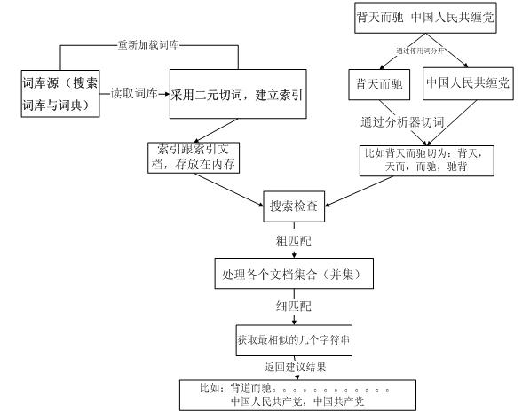
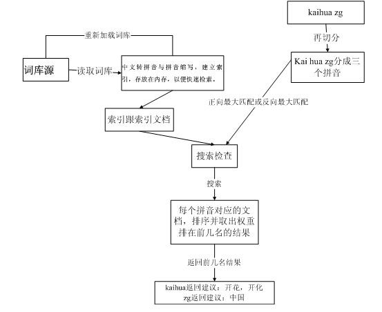

# 拼写检查 

基于汉字和拼音做双重纠错,主要可解决什么问题？

* 1、在pc互联网时代，拼音输入法作为主要的输入法，用户的搜索在使用上会不小心以拼音做为输入query，需要系统自动识别用户输入意图的真实query;
  全拼的输入法会遇到几种情况 ，比如带g不带g情况，用户拼音输入错误，需要纠正。如：zhongguo ,zhonguo;
  还有拼音对应的中文有多种对应词，需要找到最合适的中文query; 如：kaihua  --> 开花，开化
* 2、用户除了输入全拼，还有可能就输入的是中文对应的简拼；如:zg  --> 中国

* 除了拼音纠错需要，还有汉字纠错需求，如，因为同音字输入性错误：国民档  --》国民党 ；
  其它错误，如： 背天而驰 --》 背道而驰 等等；
  
* 中文与拼音的混合输入纠错需要；背道而chi  --》 背道而驰 
   

## 设计
* 中文拼写检查

  

* 拼音拼写检查

  

  
## 接口

 
* 重新加载所有词的请求,会加载项目文件

http://${host}:${post}/status?oper=reload

* 拼写检查的请求URL
http://${host}:${post}/spellcheck?input=${word}&sugNum=10&type=cn

