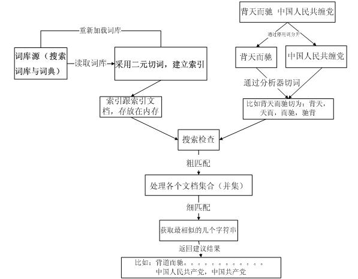
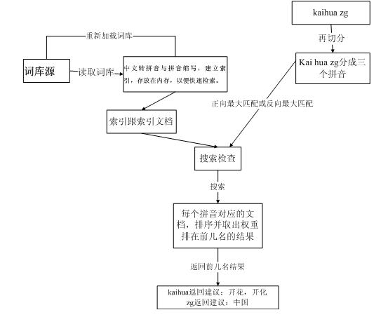

# 拼写检查 

基于汉字和拼音做双重纠错,主要可解决什么问题？在pc互联网时代，拼音输入法作为主要的输入法，用户的搜索在使用上会不小心以拼音做为输入query，需要系统自动识别用户输入意图的真实query;

* 全拼的输入法会遇到几种情况 ，比如带g不带g情况，用户拼音输入错误，需要纠正。如：zhongguo ,zhonguo;
  还有拼音对应的中文有多种对应词，需要找到最合适的中文query; 如：kaihua  --> 开花，开化
  
* 用户除了输入全拼，还有可能就输入的是中文对应的简拼；如:zg  --> 中国

* 除了拼音纠错需要，还有汉字纠错需求，如，因为同音字输入性错误：国民档  --》国民党 ；
  其它错误，如： 背天而驰 --》 背道而驰 等等；
  
* 中文与拼音的混合输入纠错需要；背道而chi  --》 背道而驰 
   

## 方案设计

主要实现简单搜索引擎，实现了拼写检查、倒排索引 、文档排序功能，其中部分用到lucene的拼写检查扩展的工具类实现，主要是实现编辑距离计算；

下面主要针对拼音与中文纠错部分实现设计
* 中文拼写检查

  
  
  <a href="./docs/CJK.md" >可再看docs下文档CJK.md🔗</a>

* 拼音拼写检查

  
  
   <a href="./docs/spell.md">可再看docs下文档spell.md🔗</a>
   
* 索引结构的设计与构建 

   <a href="./docs/index.md">可再看docs下文档index.md🔗</a>

* 词库更新与维护 --暂时只是提供简单的词库文件，正常业务需要根据场景设计，如对每天的搜索query清洗提炼，主要对当下热度的词可以快速感知
  
## 接口

 
* 重新加载所有词的请求,会加载项目文件

http://${host}:${post}/status?oper=reload

* 拼写检查的请求URL
http://${host}:${post}/spellcheck?input=${word}&sugNum=10&type=cn

